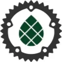

# Vorstellung

presentation: <https://rust-augsburg.github.io/meetup/>

repo: <https://github.com/rust-augsburg/meetup>

Achtung an alle Rust-Begeisterten!

Ihr seid herzlich eingeladen, unserer Rust-Gruppe beizutreten, in der wir die Feinheiten und Besonderheiten dieser großartigen Programmiersprache entdecken. Ob erfahrener Rustacean oder neugieriger Anfänger – wir freuen uns auf alle, die Teil unserer Gemeinschaft werden möchten und die Leidenschaft für Rust teilen.

Gemeinsam tauchen wir in die neuesten Rust-Updates ein, tauschen Wissen aus und arbeiten an spannenden Projekten, die uns herausfordern und inspirieren. Schließt euch uns an, während wir unsere Rust-Fähigkeiten schärfen und die Welt der Programmierung auf eine neue Weise erobern.

Verpasst nicht diese großartige Gelegenheit, euch mit anderen Rust-Fans zu vernetzen und eure Fähigkeiten auf das nächste Level zu bringen. Let's Rust and roll!

Ihr findet uns auf Matrix: [#rust-augsburg:matrix.org](https://matrix.to/#/#rust-augsburg:matrix.org)

## Wann
Nächste Termin: [Augsburg Rust Meetup #16](./Meetup_16.md)

## Wo

Stadtbücherei Augsburg

Ernst-Reuter-Platz 1 · Augsburg, BY

2.OG Zimmer 212

<iframe src="https://www.google.com/maps/embed?pb=!1m18!1m12!1m3!1d2509.0434000470486!2d10.890185387218516!3d48.36928796093488!2m3!1f0!2f0!3f0!3m2!1i1024!2i768!4f13.1!3m3!1m2!1s0x479ebd519f2b94c1%3A0x1dd3e93142054e2b!2sStadtb%C3%BCcherei%20Augsburg!5e1!3m2!1sde!2sde!4v1757881137781!5m2!1sde!2sde" width="600" height="450" style="border:0;" allowfullscreen="" loading="lazy" referrerpolicy="no-referrer-when-downgrade"></iframe>

## Veranstalter
### Tiago Manczak <https://github.com/tiagomanczak>

### Michael Schury <https://github.com/datenzauberer>
